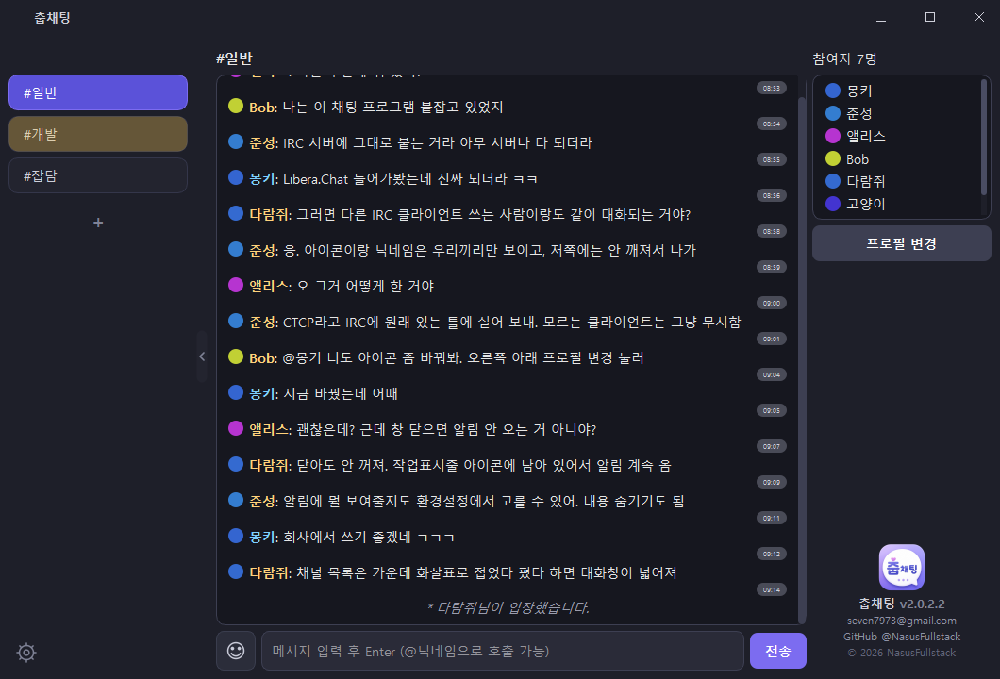

# 춥채팅 (ChupChat)


**IRC 채팅 GUI 클라이언트 — Python + PySide6로 만든 윈도우 데스크톱 앱.**

Libera.Chat 같은 표준 IRC 서버에 그대로 접속해서 쓰는 채팅 프로그램입니다.
터미널이 아니라 창 프로그램이고, 아이콘·이모티콘·링크 미리보기처럼 요즘 메신저에서 쓰는
것들을 IRC 위에 얹었습니다. (같이 들어 있는 자체 서버로 우리끼리만 쓰는 방식도 지원)



[**최신 버전 내려받기**](https://github.com/NasusFullstack/chat/releases/latest) ·
[변경 내역](CHANGELOG.md) · Windows · 설치 후 자동 업데이트

---

## 무엇을 만들었나

| | |
|---|---|
| **진짜 IRC 클라이언트** | RFC 1459 / IRCv3를 직접 구현해 Libera.Chat 등 표준 IRC 서버에 접속. 닉네임 충돌·NickServ·채널 모드까지 처리 |
| **자체 서버 모드** | IRC를 안 쓰고 싶으면 같이 들어 있는 서버(계정·채널·비밀번호, TLS)로 우리끼리만 쓸 수도 있음 |
| **자동 업데이트** | GitHub Releases에서 새 버전을 확인해 Inno Setup 설치본으로 조용히 교체하고 재시작 |
| **끊겨도 알아서 복구** | 연결이 끊기면 간격을 늘려가며 재접속하고, 보던 채널로 되돌아감 |
| **링크 미리보기 / 이모티콘** | 이미지·움짤·뉴스 카드를 클라이언트에서 직접 렌더링(서버 자원을 쓰지 않음) |
| **창을 닫아도 계속 받음** | 트레이에 상주하고, 새 메시지는 앱이 직접 그린 팝업으로 알림(보여줄 범위를 네 단계로 조절) |
| **누가 뭘로 접속했나** | CTCP VERSION으로 상대 클라이언트를 알아내 참여자 목록에 로고로 표시(WeeChat·irssi·Discord 다리 등) |
| **IRC에 없는 것들을 얹음** | 프로필 아이콘·표시 닉네임·@호출 알림을 CTCP 프레임으로 주고받아, 다른 IRC 클라이언트와 같은 채널에 있어도 대화가 깨지지 않음 |

## 어떻게 만들었나

**도메인 코어와 화면을 분리했습니다(헥사고날).** `chat_core/`는 Qt도 소켓도 파일도 모릅니다.
"로그인이 됐는가, 누가 나갔는가, 이 메시지가 나를 호출했는가" 같은 판단은 전부 코어가 하고,
GUI와 CLI는 그 결과(이벤트)를 화면에 그리기만 합니다. 덕분에 코어 테스트는 창을 띄우지 않고
순수 파이썬으로 돌아갑니다.

```
chat_core/     도메인 코어 - 상태와 정책 (Qt/asyncio 없음)
  ports.py       경계 정의: 저장소 / 프로토콜 / 전송
  protocols/     커스텀·IRC 전략 (프로토콜 추가 시 코어를 안 고침)
gui/
  pages/         화면 - 부품을 조립만 함
  components/    채널목록 · 참여자 · 입력줄 · 메시지 · 대화목록 · 손잡이/톱니바퀴
  preview/       링크 미리보기(받아오기/이미지/카드)
  styles/        QSS를 영역별로 나눈 것 + 테마 색표(palette.py)
  toast.py       앱이 직접 그리는 알림 팝업 / tray.py 트레이 상주
  event_router.py  도메인 이벤트 -> 화면 동작 표
server.py        asyncio 서버 (TLS)
```

**프로토콜 분기를 코드에서 없앴습니다.** `if protocol == "irc"` 같은 분기 대신 전략 객체와
표(registry)를 씁니다. 새 프로토콜은 클래스 하나 만들고 표에 한 줄 등록하면 됩니다.

**회귀 테스트 50개**가 실제 서버를 띄워서 돕니다(`python tests/run_all.py`).
화면을 건드리는 작업은 [픽셀 단위 비교 도구](tests/ui_snapshot.py)로 리팩토링 전후가
같은지 확인합니다 — 기능 테스트는 배치가 몇 px 틀어진 것을 못 잡기 때문입니다.

**겪은 문제와 원인은 [CLAUDE.md](CLAUDE.md)에 남깁니다.** 예를 들어 IRC의 512바이트 제한
때문에 아이콘이 잘려 채팅에 쓰레기 문자가 노출된 일, 채팅이 통째로 안 보이던 높이 계산
오류(폭에 따라 줄 수가 달라지는데 계산이 그걸 반영 못 함) 같은 것들입니다.

## 기술

`Python 3.13` `PySide6 (Qt6)` `IRC (RFC 1459 · IRCv3)` `asyncio` `TLS` `PyInstaller` `Inno Setup` `GitHub Actions`

---

## 어디에 접속하나

접속 화면에서 둘 중 하나를 고릅니다.

| | **실제 IRC 서버** (기본 사용) | 자체 서버 (`server.py`) |
|---|---|---|
| 어디에 | Libera.Chat 등 표준 IRC 네트워크, 친구가 돌리는 IRC 서버 | 우리 중 한 명이 켠 파이썬 서버 |
| 로그인 | 닉네임만 (NickServ 비밀번호는 선택) | 아이디 + 비밀번호 계정 |
| 채널 | 서버의 기존 채널에 그대로 입장 | 채널을 직접 만들고 비밀번호 설정 가능 |
| 준비물 | 없음 — 주소만 알면 접속 | 서버를 켤 사람 + `cert.pem` 배포 |

IRC 쪽이 기본입니다. 아래의 서버 설치 안내는 **자체 서버를 쓰고 싶을 때만** 필요합니다.

---

## 🖥️ GUI vs CLI — 뭘 써야 하나요?

| | GUI (`gui_client.py`) | CLI (`cli_client.py`) |
|---|---|---|
| 모습 | 진짜 창 프로그램 | 터미널, 텍스트만 |
| 한글 입력 | ✅ 문제없음 | ✅ 문제없음 |
| 인증서 경로 입력 | 파일 선택 버튼으로 클릭만 | 직접 붙여넣기 (자동 감지 지원) |
| 추천 대상 | **대부분의 사람 (기본 추천)** | 가장 가벼운 걸 원하는 사람 |

---

## 🚀 제일 쉬운 실행법 (윈도우, 더블클릭)

Python만 미리 설치되어 있으면 (<https://www.python.org/downloads/> 에서 설치, "Add Python to PATH" 꼭 체크) 나머지는 자동입니다.

- **서버를 켤 대표 한 명**: `서버_실행.bat` 더블클릭
  - 라이브러리 자동 설치 + 서버 실행 + 본인 IP 주소 화면에 표시됨
  - 처음 실행 시 같은 폴더에 `cert.pem`, `key.pem`이 자동 생성됨
  - `key.pem`은 절대 남에게 공유하지 말 것 (서버만 보관)
  - `cert.pem`은 참여자들에게 IP 주소와 함께 전달할 것
  - 이 창은 계속 켜두어야 함 (닫으면 서버 종료)
- **참여하는 친구들 각자**: `채팅_시작_GUI.bat` (추천) 또는 `채팅_시작_CLI.bat` 더블클릭
  - 라이브러리 자동 설치 후 서버 주소/인증서 입력 화면
  - 대표가 알려준 IP와 `cert.pem`을 입력/선택 → 회원가입 → 로그인 → 채널 생성/입장 → 채팅

같은 컴퓨터에서 테스트만 해볼 거면 서버 주소는 그냥 비워두거나 `127.0.0.1`로 접속하면 됩니다.

---

## 💿 친구들 컴퓨터에 파이썬 없이 실행하고 싶다면 (exe로 배포)

1. **본인 컴퓨터에서 딱 한 번만**: `exe로_빌드하기.bat` 더블클릭
   - 본인 컴퓨터에는 Python이 있어야 빌드 가능 (친구들 컴퓨터는 필요 없음)
   - `dist` 폴더 안에 exe들이 생성됨:
     - `FriendChat_GUI.exe` → **추천**, 창 프로그램
     - `FriendChat_CLI.exe` → 가벼운 텍스트 버전
     - `FriendChat_Server.exe` → 대표(서버 켜는 사람)가 실행

2. 친구들은 원하는 클라이언트 exe만 받아서 더블클릭하면 파이썬 설치 없이 바로 실행됩니다.

**참고**: exe는 빌드한 컴퓨터의 운영체제 기준으로 만들어집니다. GUI 버전은 Qt 라이브러리가 포함돼서 파일 용량이 좀 큽니다 (100MB 이상 가능).

---

## 🌐 내 컴퓨터에 파이썬 자체를 설치하기 싫다면 (GitHub Actions로 빌드)

이 저장소에 이미 `.github/workflows/build.yml`이 포함돼 있어서, 코드를 GitHub에 올리기만 하면 자동으로 빌드됩니다.

1. 저장소에 파일 전부 업로드 (`Add file → Upload files`), `Commit changes`
2. 저장소 상단 **`Actions`** 탭 → "Build Windows EXE" 자동 실행 (5~10분 소요, GUI 빌드 포함)
3. 완료되면 **`Artifacts`**에서 다운로드:
   - `FriendChat-Windows` → GUI/CLI/서버 exe 전부 (Windows용)
   - `FriendChat-Server-Linux` → 리눅스 서버용 실행 파일

코드를 수정하고 다시 커밋할 때마다 자동으로 새로 빌드됩니다.

---

## 🐧 리눅스 서버에서 직접 실행하고 싶다면

```bash
pip install -r requirements.txt
python server.py 6667 6697
```

- 평문(암호화 없음) 포트와 TLS(SSL 암호화) 포트를 동시에 엽니다. IRC 관례대로 기본값은 `6667`(평문) / `6697`(SSL)이며, 원하는 포트로 바꿔도 됩니다.
- 이 서버를 계속 켜둘 컴퓨터 또는 클라우드 VM에서 실행하세요.
- 데이터(계정/채널 정보)는 `server_data.json`에 저장됩니다. (비밀번호는 평문이 아니라 salt+sha256 해시로 저장)
- 방화벽/공유기에서 사용할 포트를 열어줘야 외부 친구들이 접속 가능합니다.
- 최초 실행 시 `cert.pem`, `key.pem`이 자동 생성됩니다. SSL로 접속할 친구들에게 `cert.pem`을 나눠주세요.

## 클라이언트 직접 실행

```bash
pip install -r requirements.txt

# GUI
python gui_client.py

# CLI
python cli_client.py <서버주소> <포트> [cert.pem 경로] [ssl여부: on/off, 기본 on] [프로토콜: custom/irc, 기본 custom]
```

- GUI/CLI 모두 접속할 때 SSL 사용 여부(포트 6697/6667)와 인증서 사용 여부를 선택할 수 있습니다.
- 접속 화면에서 "친구 채팅 서버(커스텀)" 대신 "실제 IRC 서버"를 선택하면, 아이디/비밀번호 계정 대신 닉네임만으로 접속합니다. 비밀번호를 입력하면 서버 접속 비밀번호(PASS)와 NickServ `IDENTIFY`에 함께 사용됩니다. 닉네임이 이미 쓰이고 있으면 자동으로 `_`를 붙여 재시도합니다.
- 자주 쓰는 서버는 "공용서버 등록"으로 저장해두면 다음부터 목록에서 바로 골라 접속할 수 있습니다 (`servers.json`에 로컬 저장, 프로토콜 종류도 함께 저장됨).
- 접속 시도는 최대 10초 후 자동 취소되며, GUI는 '연결 취소' 버튼으로, CLI는 Ctrl+C로 언제든 즉시 중단할 수 있습니다.

## 현재 구현된 것

**IRC 클라이언트로서**
- NICK/USER 등록, NickServ IDENTIFY, PING/PONG 자동 응답
- JOIN / PART / QUIT / NICK / KICK / INVITE / MODE / TOPIC 처리, 참여자 목록 실시간 갱신
- 닉네임이 이미 쓰이는 중이면 자동으로 바꿔 재시도
- 여러 채널 동시 참여 (왼쪽 목록에서 전환)
- 슬래시 명령 — `/msg` `/whois` `/topic` `/away` `/invite` `/kick` `/mode` `/list` `/raw` 등

**IRC에는 없지만 얹은 것** (우리 클라이언트끼리 CTCP로 주고받음 - 다른 IRC 클라이언트가
같은 채널에 있어도 대화가 깨지지 않습니다)
- 프로필 아이콘, 표시 닉네임
- `@닉네임` 호출 알림 (작업표시줄 깜빡임 + 창 흔들림, 1분 쿨타임)
- 이모티콘 보관함 (주소만 로컬 저장, 쓴 것만 전송). 입력창에는 `[:이름:]`으로 보이고
  실제로는 이모티콘으로 전송됨
- 링크 미리보기 — 이미지·움짤은 바로, 뉴스/게시물은 카드로 (전부 클라이언트가 처리)

**창 밖에서도**
- 창을 닫아도 종료되지 않고 트레이에 상주 (종료는 트레이 메뉴에서)
- 새 메시지 알림을 앱이 직접 그림 — 윈도우 기본 알림을 쓰지 않아 모양과 위치가 일정하고,
  연달아 오면 하나로 묶여 최신 것만 뜸
- 알림에 무엇까지 보여줄지 선택: 보낸 사람과 내용 / 사람만 / 메시지만 / 모두 숨김
- 환경설정(트레이 메뉴 또는 채널 목록 아래 톱니바퀴) — 알림 / 테마 / 정보 탭

**참여자**
- 그 사람이 무슨 프로그램으로 접속했는지 로고로 표시 (한 마디도 안 한 사람도 알 수 있음).
  30종을 알아보고, 봇·서비스는 로봇 모양 / 휴대폰 접속은 휴대폰 모양으로 구분
- 로고는 공식 사이트에서 한 번만 받아 저장하고, 못 받으면 글자 배지로 대체
- 여러 명을 확인할 때는 채널에 한 줄만 보냄(사람 수만큼 보내면 막는 서버가 있음)
- 한 번 알아낸 사람은 서버별로 기억해서 다시 묻지 않음(일주일마다 한 번만 재확인)
- 디스코드로 이어진(브릿지) 계정은 물어봐도 답할 수 없으므로 이름으로 알아봄
- 확인 요청을 막아둔 서버에서는 **자동으로 멈추고** 다시 시도하지 않음.
  그런 서버에서도 춥채팅끼리는 아이콘을 주고받으며 서로를 알아봄(추가 요청 없이)

**보기 편하게**
- 채널 목록을 접었다 펼 수 있음 (경계 가운데 손잡이, 접으면 대화창이 그만큼 넓어짐)
- 안읽은 채널은 줄 전체가 옅은 노란색으로 깜빡이고 읽을 때까지 유지
- 참여자 목록은 6명까지 보이고 나머지는 스크롤, 머리글에 인원수 표시
- 위로 올려 지난 대화를 읽는 중에는 새 메시지가 와도 화면이 끌려 내려가지 않음
  (내가 보낸 메시지는 항상 맨 아래로)

**공통**
- 메시지 기록 로컬 저장 (채널당 최근 200개, 재입장 시 이어서 표시 - `history.json`)
- 연결이 끊기면 간격을 늘려가며 자동 재접속하고 보던 채널로 복귀
- 자동 업데이트 (GitHub Releases 확인 → 설치본 교체 → 재시작)
- 평문 / TLS 접속 선택, 공용서버 등록, 접속 타임아웃 및 취소

**자체 서버 모드에서 추가로**
- 계정 회원가입/로그인 (비밀번호 해시 저장)
- 채널 생성 + 채널 비밀번호(선택), 입장 시 검증
**입력 도우미**
- `@`를 치면 참여자 목록이 떠서 고를 수 있음 (`@몽`처럼 앞글자를 치면 좁혀짐, 한글도 됨)
- `/`를 치면 지금 접속한 서버에서 쓸 수 있는 명령 목록이 뜸
  (`/`로 시작하는 평범한 메시지를 보내려면 `//메시지`처럼 두 번)

## 치트 이스터에그

채팅창에 그대로 치면 그 채널에 있는 모두의 화면에 뜹니다 (채널당 1분 쿨타임).

| 문구 | 효과 |
|---|---|
| `show me the money` | 미네랄/가스가 0 → 10000까지 올라갔다 사라짐 |
| `배틀크루저 소환` | 함선이 떠서 **방향키로 조종** 가능 (가만두면 제자리에서 둥실둥실) |
| `배틀크루저 소환해제` | 함선이 가속해서 화면 밖으로 사라짐 |

> 방향키는 **입력창이 비어 있을 때만** 함선 조종에 쓰입니다. 메시지를 쓰는 중이면
> 평소처럼 커서가 움직이니 채팅에 지장 없습니다.

### 그림을 원본 게임 이미지로 바꾸고 싶다면

기본은 코드로 그린 그림이 나옵니다. 아래 이름의 PNG를 **`FriendChat_GUI.exe`가 있는 폴더**에
넣으면(소스로 실행 중이면 저장소 폴더) 그 이미지를 대신 씁니다. 저장소에는 포함되지 않으므로
쓰고 싶은 사람이 각자 넣으면 됩니다.

| 파일명 | 쓰이는 곳 |
|---|---|
| `battlecruiser.png` | 배틀크루저 (배 **한 대만**, 뱃머리가 **위쪽(12시)**을 향하게) |
| `mineral.png` | 미네랄 아이콘 |
| `gas.png` | 가스 아이콘 |

배틀크루저는 넣기만 하면 **팀컬러(분홍) → 회색 자동 변환**, **투명 여백 자동 제거**(안 하면
회전축이 어긋나 배가 원을 그리며 돕니다), **큰 이미지 자동 축소**까지 알아서 처리합니다.
파일이 없으면 그냥 기본 그림이 나오므로 안 넣어도 아무 문제 없습니다.

## 아직 없는 것

- 이미지/파일 전송
- 실제 IRC 모드: SASL, DCC, CAP 협상은 지원하지 않음
- `@닉네임` 자동완성의 초성 검색(`ㅁ` → `몽키`) — 앞글자 검색만 됩니다
